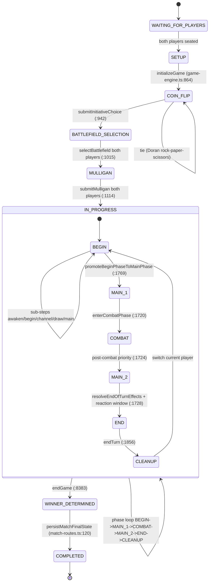

# Riftbound Online Backend - Architecture Deep Dive

Scope: runtime game engine, match orchestration, and the AWS/GraphQL carrier that surrounds it.
Audience: engineers onboarding onto the game server, rules verification, and risk review.
Non-goals: deck builder UI, frontend rendering, infrastructure cost tuning.
Citations use `path:line` and all line numbers reference the current source tree.

---

## 1. Overview

Riftbound Online is a two-player trading card duel server. A single stateful `RiftboundGameEngine` class (`src/game-engine.ts:561`) owns the entire match state and is reconstructed from a serialized JSON blob on every HTTP request. The engine exposes public methods for all player actions and returns a new `GameState` that is then projected through a viewer-scoped serializer (`src/game-state-serializer.ts:448`) and persisted to DynamoDB by REST route handlers (`src/match-routes.ts:2076`).

GraphQL acts as a thin facade in front of the REST handlers (`src/graphql/resolvers.ts:1552` for mutations), proxying to the internal HTTP API and re-publishing state to subscribers via `graphql-subscriptions` PubSub (`src/graphql/pubsub.ts:3`). Matchmaking is driven by an SQS long-polling worker (`src/matchmaking-queue-worker.ts:1`) that calls `runMatchmakingSweep` in the resolvers (`src/graphql/resolvers.ts:1203`).

| Layer | Entry point | File |
| --- | --- | --- |
| HTTP/GraphQL server | Express + Apollo | `src/server.ts:1` |
| REST match API | `registerMatchRoutes` | `src/match-routes.ts:2076` |
| GraphQL schema | `typeDefs` | `src/graphql/schema.ts:1` |
| Resolvers | query/mutation/subscription | `src/graphql/resolvers.ts:1268`, `:1552`, `:2800` |
| Game engine | `RiftboundGameEngine` | `src/game-engine.ts:561` |
| State projection | `serializeGameState` | `src/game-state-serializer.ts:448` |
| Card catalog | enriched JSON loader | `src/card-catalog.ts:1244` |
| Champion cost parser | `parseChampionAbilityCost` | `src/champion-utils.ts:46` |
| Matchmaking worker | SQS long-poll | `src/matchmaking-queue-worker.ts:1` |

Runtime constants (`src/game-engine.ts:565-570`):

| Constant | Value | Meaning |
| --- | --- | --- |
| `INITIAL_HAND_SIZE` | 4 | Opening hand |
| `VICTORY_SCORE` | 8 | Default victory threshold |
| `MIN_DECK_SIZE` | 39 | Minimum main deck size |
| `RUNE_DECK_SIZE` | 12 | Fixed rune deck count |
| `RUNES_PER_TURN` | 2 | Channeled per Channel step |
| `DEFAULT_BATTLEFIELD_COUNT` | 2 | Per-player battlefield draft size |

Storage: DynamoDB tables for users, matches, match history, match states, and matchmaking queue, referenced via `TABLE_NAMES` in resolvers and `MATCH_TABLE`/`MATCH_HISTORY_TABLE`/`STATE_TABLE`/`MATCHMAKING_QUEUE_TABLE` in `src/match-routes.ts`. Auth is AWS Cognito; game state is flattened to JSON and written to the match-states table on every mutating route (`persistMatchFinalState` at `src/match-routes.ts:120`).

---

## 2. Turn Structure, Phases, and Priority

### 2.1 Game-wide lifecycle

`GameStatus` (`src/game-engine.ts:364`): `WAITING_FOR_PLAYERS -> SETUP -> COIN_FLIP -> BATTLEFIELD_SELECTION -> MULLIGAN -> IN_PROGRESS -> WINNER_DETERMINED -> COMPLETED`.

### 2.2 Turn phase enum

`GamePhase` (`src/game-engine.ts:355`): `BEGIN -> MAIN_1 -> COMBAT -> MAIN_2 -> END -> CLEANUP`.

### 2.3 Turn sequence sub-steps

`TurnSequenceStep` (`src/game-engine.ts:375`) runs inside `BEGIN`:

| Step | Trigger | Source |
| --- | --- | --- |
| `awaken` | Untap permanents | `beginTurn` at `src/game-engine.ts:1346` |
| `begin` | Start-of-turn triggers | same |
| `channel` | Channel 2 runes | `channelRunes` at `src/game-engine.ts:1391` |
| `draw` | Draw 1 (skip turn 1 active) | `drawCards` at `src/game-engine.ts:3103` |
| `main` | Transition to `MAIN_1` | `promoteBeginPhaseToMainPhase` at `src/game-engine.ts:1769` |

### 2.4 Phase advancement

Driven by `advancePhaseOnce` (`src/game-engine.ts:1710`) and `proceedToNextPhase` (`src/game-engine.ts:1810`). Phase transitions:

| Current | Action | Next |
| --- | --- | --- |
| `BEGIN` (pending main) | `tryAutoAdvanceFromBeginPhase` at `:1779` | `MAIN_1` |
| `BEGIN` (fresh) | `beginTurn` | stays, advances sub-steps |
| `MAIN_1` | `enterCombatPhase` | `COMBAT` |
| `COMBAT` | opens `main` priority window (`:1724`) | `MAIN_2` |
| `MAIN_2` | `resolveEndOfTurnEffects` + opens `reaction` priority window | `END` |
| `END` | `endTurn` at `:1856`, swap current player | `CLEANUP` -> `BEGIN` |

`proceedToNextPhase` has an internal safety counter (`MAX_PHASE_ADVANCES = 10` at `:1814`) to prevent auto-advance runaway.

### 2.5 Priority model

`PriorityWindow` (`src/game-engine.ts:290`) has a `holder`, a `type` (`main` or `reaction` or `combat`), an `event` label, and optional `expiresAt`. Windows are opened by `openPriorityWindow` and closed by `closePriorityWindow`. `passPriority` (`src/game-engine.ts:2891`) delegates to `handleCombatPriorityPass` (`src/game-engine.ts:8284`) when a combat window is active, otherwise it just closes the window. Combat priority rotates between attacker and defender during the `COMBAT` phase; only the holder may cast reaction spells or activate reaction abilities.

Reaction priority also opens at the top of the end step (`:1731`) so the non-turn player gets a chance to cast instants before cleanup.

---

## 3. Effect Stack / Ability Resolution Model

Riftbound models a LIFO "Reaction Chain" shaped like the MTG stack.

### 3.1 Core types

| Type | Purpose | File |
| --- | --- | --- |
| `ChainItemType` | `'spell' \| 'triggered_ability' \| 'activated_ability'` | `src/game-engine.ts:465` |
| `ChainItem` | single stack entry, carries `card`, `casterId`, `targets`, `abilityName`, `sourceInstanceId` | `src/game-engine.ts:468` |
| `ReactionChain` | stack of items + `currentReactorId` + `originalCasterId` + `awaitingResponse` flag | `src/game-engine.ts:481` |
| `PendingSpellResolution` | legacy single-spell shim kept for back-compat | `src/game-engine.ts:492` |

### 3.2 Lifecycle

1. Caster triggers `addToReactionChain` (`src/game-engine.ts:3192`). If no chain exists, a new one is created with the opponent as `currentReactorId`. If a chain exists, the new item is pushed and the reactor flips (`:3219`).
2. The reactor calls `respondToChainReaction` (GraphQL `src/graphql/resolvers.ts:2258`, REST route `/respond-to-chain-reaction`). Passing triggers `resolveReactionChain`; playing another spell/ability calls `addToReactionChain` again.
3. `resolveReactionChain` (`src/game-engine.ts:3441`) drains the stack in reverse order (LIFO). Spells route to `resolveSpell` (`:3596`); abilities route to `resolveChainedAbility` (`:3490`), which re-hydrates the source card by `instanceId` so destruction during chain does not crash resolution.
4. Both `spell` and `ability` resolution ultimately call `executeEffectOperations` (`src/game-engine.ts:3690`).

### 3.3 Effect operation dispatcher

`executeEffectOperations` is a large switch on `operation.type`. Key branches:

| Operation | Handler line |
| --- | --- |
| `draw_cards` | `src/game-engine.ts:3707` |
| `mill_cards` | `:3714` |
| `discard_cards` | `:3724` (self default, targeted via `targetHint: 'enemy'`) |
| `modify_stats` | `:3751` (adds temporary effect with `damage_boost`) |
| `deal_damage` | `:3771` |
| `heal` | `:3785` |
| `remove_permanent` | `:3798` |
| `summon_unit` / `create_token` | `:3812` (logs `${type}-manual` for variable/flexible tokens) |
| `return_from_graveyard` | `:3826` (may defer via `deferTargetSelectionForOperation`) |
| battlefield `objective` scoring | `:4181` |
| default (unhandled) | `:4191` - logs `unhandled-operation-<type>` |

Operation dispatch is NOT a generic interpreter. Fallback paths `handleSpecialSpell` (`:4198`) and `handleSpecialBattlefieldEffect` (`:7495`) pattern-match on card IDs (e.g. `OGN-276`, `OGN-293`, `SFD-219`, `OGN-284`, `OGN-290`, `OGN-277`) for hand-coded behavior.

### 3.4 Prompts and deferred resolution

When an operation needs user input (targeting, discard choice), the engine stashes a `PendingEffect` (`src/game-engine.ts:453`) and emits a `GamePrompt` (`:279`). The UI resolves the prompt via `submitDiscardSelection` / `submitTargetSelection` (schema `src/graphql/schema.ts:674`, `:681`), which re-enters `executeEffectOperations` from `startIndex = nextIndex` so operations resume in order.

---

## 4. State Machine



End reasons recorded on `GameState.endReason` (`src/game-engine.ts:507`): `victory_points | burn_out | concede | timeout`.

---

## 5. Card Loading from Catalog + Effect Dispatch

### 5.1 Catalog source

The canonical catalog is a pre-computed JSON file resolved at process `cwd`:

```
path.resolve(process.cwd(), 'data', 'cards.enriched.json')  // src/card-catalog.ts:1244
```

Loading is lazy and cached:

| Function | Purpose | Line |
| --- | --- | --- |
| `loadFromEnrichedFile` | read + parse JSON once | `src/card-catalog.ts:1784` |
| `requireEnrichedCatalog` | throws if the file is missing/invalid | `:1802` |
| `findCardById` / `findCardBySlug` / `findCardByName` | indexed lookups | `:1821`, `:1825`, `:1829` |
| `buildActivationStateIndex` | stateful activation templates | `:1843` |
| `analyzeSpellTargeting` | derive `SpellTargetingProfile` | `:1958` |
| `buildEffectProfile` | compile effect text to operations | `:1181` |

`RiftboundGameEngine` wires the catalog via `buildActivationStateIndex()` in the constructor (`src/game-engine.ts:571`) and keeps a per-match `catalogCardCache` Map (`:572`) to avoid re-resolving the same card ID repeatedly.

### 5.2 Card -> runtime conversion

Decks are supplied as `PlayerDeckConfig` (`src/game-engine.ts:202`). Each entry is a `Card`, a slug string, or a `DeckCardReference` (`:223`). During `initializeGame` (`:864`), entries are expanded to full `Card` objects. Catalog cards carry an `effectProfile` with a list of `EffectOperation`s; this is what the engine dispatches in `executeEffectOperations`. The `EffectOperationType` union lives in `src/card-catalog.ts:75-135` (~60 variants such as `draw_cards`, `deal_damage`, `return_from_graveyard`, `create_token`, `channel_runes`, `move_unit`, `modify_stats`, etc.).

### 5.3 Spell targeting

`SpellTargetingProfile` (`src/graphql/schema.ts:90`) carries `scope`, `minTargets`, `maxTargets`, `requiresSelection`, `allowFriendly`, `allowEnemy`, `mode`, `hint`. The engine validates targets via `validateSpellTargets` (`src/game-engine.ts:2073`) before moving a card to the stack.

### 5.4 Champion legend cost parsing

`src/champion-utils.ts` parses rich-text tokens such as `:rb_energy_2:`, `:rb_rune_fury:`, `:rb_exhaust:` into a `ChampionAbilityCost` (`:5`). `hasManualActivation` (`:26`) distinguishes activated abilities (`::` marker) from passives/triggers. The engine uses `canSatisfyChampionCost` (`:131`) before debiting runes via `tryAllocateRunesForCost` (`src/game-engine.ts:1570`).

---

## 6. Multiplayer / Match Flow

### 6.1 Matchmaking

1. Client calls `joinMatchmakingQueue` mutation (`src/graphql/resolvers.ts:2675`), which writes a row to the `MatchmakingQueue` DynamoDB table and enqueues an SQS message.
2. The long-poll worker (`src/matchmaking-queue-worker.ts:1`) pulls messages (20s wait) for both `ranked` and `free` queues and calls `runMatchmakingSweep` (`src/graphql/resolvers.ts:1203`).
3. `runMatchmakingSweep` repeatedly calls `attemptMatch` until no more pairs are made. A pair triggers `spawnMatchService` (`:205`), which POSTs to the internal match service `/matches/init` endpoint.

### 6.2 Match initialization

`POST /matches/init` (`src/match-routes.ts:569`) creates a new `RiftboundGameEngine`, calls `initializeGame` with both decks, and persists the initial state. Subsequent actions use per-action routes (full set at `src/match-routes.ts`):

| Route | Purpose |
| --- | --- |
| `POST /matches/:matchId/player/:playerId/initiative` | coin flip pick |
| `POST /matches/:matchId/player/:playerId/select-battlefield` | battlefield draft |
| `POST /matches/:matchId/player/:playerId/mulligan` | mulligan indices |
| `POST /matches/:matchId/player/:playerId/play-card` | cast from hand |
| `POST /matches/:matchId/player/:playerId/attack` | declare attacker |
| `POST /matches/:matchId/player/:playerId/move` | reposition unit |
| `POST /matches/:matchId/player/:playerId/hide-card` | hide to a battlefield |
| `POST /matches/:matchId/player/:playerId/activate-hidden` | reveal hidden card |
| `POST /matches/:matchId/player/:playerId/commence-battle` | open combat priority |
| `POST /matches/:matchId/player/:playerId/activate-legend` | champion ability |
| `POST /matches/:matchId/player/:playerId/pass-priority` | priority pass |
| `POST /matches/:matchId/player/:playerId/respond-to-spell-reaction` | single-spell response (legacy) |
| `POST /matches/:matchId/player/:playerId/respond-to-chain-reaction` | chain response |
| `POST /matches/:matchId/player/:playerId/target` | resolve target prompt |
| `POST /matches/:matchId/player/:playerId/discard` | resolve discard prompt |
| `POST /matches/:matchId/player/:playerId/next-phase` | advance phase |
| `POST /matches/:matchId/result` | final result report (`:1849`) |
| `POST /matches/:matchId/concede` | forfeit (`:1920`) |

### 6.3 GraphQL facade

GraphQL mutations (`src/graphql/resolvers.ts:1552-2800`) POST to the internal REST API via `postMatchAction` (`:147`) and then publish the resulting state to subscribers. All state-changing mutations publish `gameStateChanged`, `playerGameStateChanged`, and optionally `cardPlayed`, `attackDeclared`, `phaseChanged`, or `matchCompleted`.

### 6.4 Subscriptions

`graphql-subscriptions` PubSub singleton at `src/graphql/pubsub.ts:3`. Channels (`:7`): `GAME_STATE_CHANGED`, `PLAYER_GAME_STATE_CHANGED`, `MATCH_COMPLETED`, `LEADERBOARD_UPDATED`, `CARD_PLAYED`, `ATTACK_DECLARED`, `PHASE_CHANGED`, `MATCHMAKING_STATUS_UPDATED`. Note: this is in-process only, so horizontal scaling of the GraphQL layer would require a Redis/SQS PubSub backend.

### 6.5 Persistence

Every mutation path writes the serialized state to DynamoDB via `persistMatchFinalState` (`src/match-routes.ts:120`), which also archives a `MatchHistory` row and cleans the matchmaking queue for both players when a match ends.

---

## 7. Serialization

### 7.1 Viewer-scoped projection

`serializeGameState` (`src/game-state-serializer.ts:448`) takes an optional `viewerId`. Each player is projected with a `PlayerVisibility` of `'self'`, `'opponent'`, or `'spectator'` (`serializePlayerState` at `:410`).

| Zone | `self` | `opponent` | `spectator` |
| --- | --- | --- | --- |
| `hand` | full | `[]` (line `:425`) | full |
| `runeDeck` | full | `[]` (line `:435`) | full |
| `handSize` | yes | yes | yes |
| `championLegendStatus` / `championLeaderStatus` | yes | `null` (line `:439`) | yes |
| `hiddenCards` on battlefields | owner sees card, others see placeholder | - | - |

`buildOpponentView` (`:509`) produces a terser `OpponentView` used by the `PlayerView` GraphQL type (`src/graphql/schema.ts:512`), hiding hand contents entirely while exposing counts, board, and champion snapshot.

### 7.2 Restore path

`RiftboundGameEngine.fromSerializedState(json)` (used in `src/__tests__/integration.test.ts:152`) rebuilds a live engine from a JSON dump, preserving match ID, turn number, phase, status, victory points, and battlefields. Integration tests assert conservation of card counts across zones (`:100`) and rune deck totals (`:110`).

### 7.3 Wire formats

Dates are ISO strings via `toDate`; `moveHistory`, `snapshots`, and `scoreLog` are copied by reference in the serializer and are safe to `JSON.stringify`. The resolvers additionally call `ensureGameStateDefaults` (`src/graphql/resolvers.ts:126`) to backfill `duelLog` and `chatLog` arrays that older DynamoDB records may not have.

---

## 8. Win / Loss / Draw Conditions

There is no draw condition; the game always resolves to a single `winner` field on `GameState`.

| Reason | Trigger | File:line |
| --- | --- | --- |
| `victory_points` | `player.victoryPoints >= player.victoryScore` inside `awardVictoryPoints` | `src/game-engine.ts:3047-3050` |
| `victory_points` (instant) | OGN-293 (seven friendly units held on its battlefield) | `src/game-engine.ts:7531-7542` |
| `burn_out` | opponent runs out of deck during `drawCards`, calls `burnOut` -> `endGame` | `src/game-engine.ts:3106` (detect) + `:3158` (endGame) |
| `concede` | `concedeMatch` called by the HTTP route | `src/game-engine.ts:2825-2847` |
| `timeout` | defined in union but not wired to an active handler; see Section 9 | `src/game-engine.ts:507` |

`endGame` (`src/game-engine.ts:8383`) sets `status = WINNER_DETERMINED`, stamps `winner` and `endReason`, and records a `match-end` snapshot (`:8391`). `getMatchResult` (`src/game-engine.ts:8418`) returns `null` until the engine is in `WINNER_DETERMINED`, otherwise returns a `MatchResult` with duration, turn count, and move history. Downstream, `persistMatchFinalState` (`src/match-routes.ts:120`) archives the result to `MatchHistory`, writes the final state blob, updates user wins/losses, and removes both players from any matchmaking queue rows.

Victory point caps: `awardVictoryPoints` clamps to `player.victoryScore` (`:3022`) so no overshoot is possible. The default `VICTORY_SCORE` is 8 (`:566`) but individual battlefields can raise it (OGN-276 bumps both players by +1 at `:7512-7515`).

---

## 9. Known TODOs / Placeholder Handlers

| Location | Severity | Description |
| --- | --- | --- |
| `src/game-engine.ts:1332` | high | `throw new Error('Target selection handler is not supported yet')` - there is at least one target resolution path not yet implemented. |
| `src/game-engine.ts:3816`, `:3820` | medium | Token creation with a `variableCount` or `flexiblePlacement` spec falls through to `logRuleUsage(..., '${type}-manual')` - the rule is flagged for manual adjudication rather than executed. |
| `src/game-engine.ts:4187`, `:4191` | high | Unhandled effect operations route to `logRuleUsage(..., 'unhandled-operation-${type}')` in both the `battlefield_objective` branch and the default case. Silent no-op for any new operation type. |
| `src/game-engine.ts:5126` | medium | `logRuleUsage(context.source, 'token-manual-resolution')` - a token/creation path defers to manual resolution. |
| `src/game-engine.ts:7292` | low | `text: 'Auto-generated battlefield placeholder.'` - generic battlefield seeded when deck config is incomplete. |
| `src/game-engine.ts:507` | medium | `timeout` is declared in `MatchResult.reason` but no server-side timer currently calls `endGame(_, _, 'timeout')`. Turn timeouts appear to be client-side only. |
| `src/game-engine.ts:7502` | high | `handleSpecialBattlefieldEffect` hard-codes behavior for card IDs OGN-276/OGN-284/OGN-290/OGN-293/OGN-277/SFD-219. Any new special battlefield requires a code change. |
| `src/game-engine.ts:4198` | medium | `handleSpecialSpell` similarly branches on hard-coded effect text substrings (graveyard-return, play-from-graveyard, channel-fallback). |
| `src/graphql/pubsub.ts:3` | medium | PubSub is in-memory only; subscriptions break under horizontal scaling. |
| `src/card-catalog.ts:1244` | low | Catalog path is resolved off `process.cwd()` rather than a packaged asset - fragile in non-standard working directories. |

The `buildMainDeck` test helper (`src/__tests__/test-helpers.ts:133`) produces a 40-card deck with no diversity, which means any test that depends on rune-color interactions is effectively unexercised by the current integration suite.

---

## 10. Risk Summary (Top 5)

| Rank | Risk | Severity | Evidence | Impact |
| --- | --- | --- | --- | --- |
| 1 | Silent fallback for unhandled effect operations | Critical | `src/game-engine.ts:4187`, `:4191` - `logRuleUsage('unhandled-operation-*')` is a no-op besides logging; any unmapped `EffectOperationType` simply does not execute | Cards with new operation types ship to players and appear to "do nothing," creating non-obvious rule bugs and potential competitive-integrity incidents. |
| 2 | Hard-coded card-ID dispatch for spells and battlefields | High | `handleSpecialSpell` at `src/game-engine.ts:4198`, `handleSpecialBattlefieldEffect` at `:7495` branch on card IDs such as OGN-293, SFD-219 | New expansions require engine code changes rather than data changes; branching grows linearly with card count and is a merge-conflict hotspot. |
| 3 | In-memory GraphQL PubSub blocks horizontal scaling | High | `src/graphql/pubsub.ts:3` uses `graphql-subscriptions`' `PubSub` singleton | A second ECS task cannot broadcast subscription events to clients connected to the other task, so subscriptions break silently under auto-scale. |
| 4 | Catalog loaded from `process.cwd()` | Medium | `src/card-catalog.ts:1244` uses `path.resolve(process.cwd(), 'data', 'cards.enriched.json')` | Container runs from an unexpected directory (local dev, tests, alt Docker entrypoint) and the catalog fails to load; engine throws on first card lookup. Packaged asset or `__dirname` would be safer. |
| 5 | `timeout` end-reason declared but unwired | Medium | `src/game-engine.ts:507` declares the reason; no engine path invokes `endGame(..., 'timeout')` | Turn-clock enforcement depends entirely on client cooperation. A stalled opponent locks a match indefinitely; no server-side forfeit. |

Honorable mentions: (a) `MatchmakingQueueWorker` has no dead-letter handling visible in `src/matchmaking-queue-worker.ts:1`, so poison messages may loop; (b) `persistMatchFinalState` at `src/match-routes.ts:120` does DynamoDB writes without a transaction, so partial failure can leave history and state out of sync.

---

## Appendix A: Key Method Index

`src/game-engine.ts`:

| Method | Line |
| --- | --- |
| `initializeGame` | 864 |
| `startCoinFlipPhase` | 926 |
| `submitInitiativeChoice` | 942 |
| `startBattlefieldSelectionPhase` | 1015 |
| `startMulliganPhase` | 1114 |
| `beginTurn` | 1346 |
| `channelRunes` | 1391 |
| `recalculateResources` | 1550 |
| `tryAllocateRunesForCost` | 1570 |
| `advancePhaseOnce` | 1710 |
| `proceedToNextPhase` | 1810 |
| `endTurn` | 1856 |
| `playCard` | 1908 |
| `validateSpellTargets` | 2073 |
| `calculateCostModifiers` | 2278 |
| `moveUnit` | 2437 |
| `deployChampionLeader` | 2505 |
| `hideCard` | 2558 |
| `activateHiddenCard` | 2626 |
| `concedeMatch` | 2825 |
| `activateChampionAbility` | 2849 |
| `passPriority` | 2891 |
| `resolveCombat` | 2972 |
| `awardVictoryPoints` | 3011 |
| `drawCards` | 3103 |
| `burnOut` | 3146 |
| `addToReactionChain` | 3192 |
| `resolveReactionChain` | 3441 |
| `resolveChainedAbility` | 3490 |
| `resolveSpell` | 3596 |
| `executeEffectOperations` | 3690 |
| `handleSpecialSpell` | 4198 |
| `applyBattlefieldControl` | 7380 |
| `checkBattlefieldHoldBonuses` | 7432 |
| `handleSpecialBattlefieldEffect` | 7495 |
| `calculateStatModifiers` | 7999 |
| `resolveBattlefieldOutcome` | 8187 |
| `handleCombatPriorityPass` | 8284 |
| `endGame` | 8383 |
| `getMatchResult` | 8418 |
